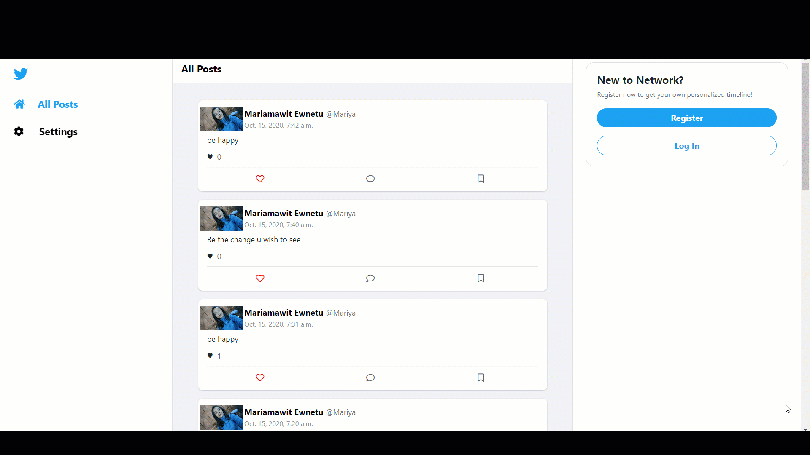
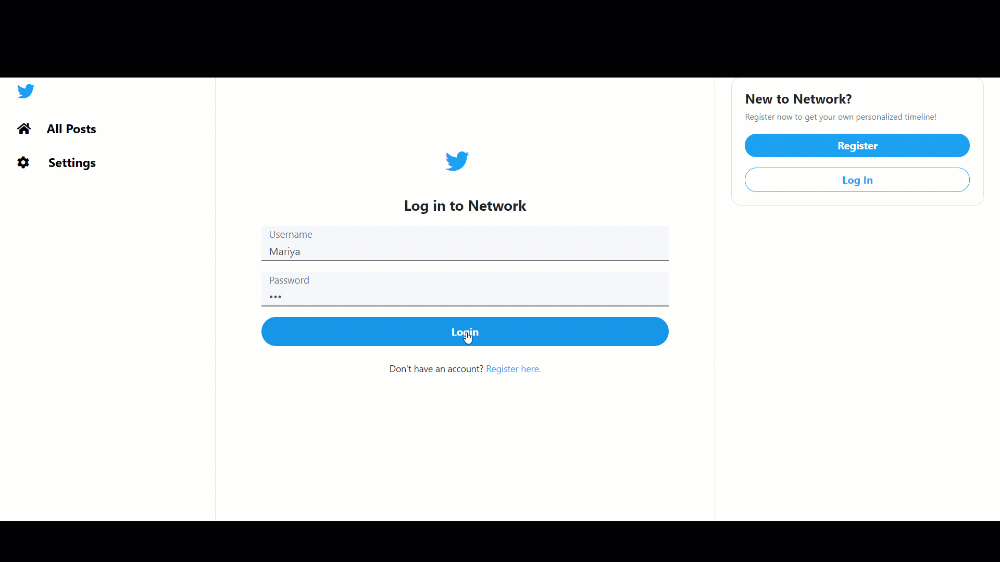
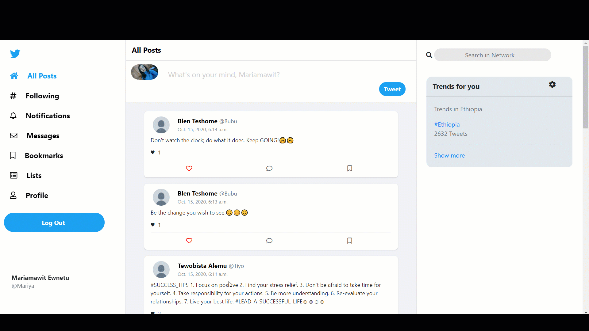

# Network
Network [Twitter]-like(https://twitter.com/) social network website for making posts and following users.Django is the main web framework used for this project.

## Overview
Network is the fourth project for Harvard CS50's Web Programming with Python and JavaScript course. The project specifications are listed [here](https://cs50.harvard.edu/web/2020/projects/4/network/).

### Project Demos
A [full demo of my project](https://www.youtube.com/watch?v=ytE-XncLtc0) can be viewed on YouTube along with all [other CS50 Web Projects](https://www.youtube.com/playlist?list=PLFXLIM6hnNVmPzRpnuOI8Og5DBVxKu15_).

Note the quality of the following clips may be lower due to conversion from video to GIF format.  

**Login and Register**  

**Create Post**  

**Profile**  

**Following**  

**Like or Unlike **  
 

### Architecture
**Frontend**
- Languages: 
 	* JavaScript
	* HTML
	* CSS
- Main Framework/Libraries:
 	* [Django Templates](https://docs.djangoproject.com/en/3.1/ref/templates/language/)
	* [Bootstrap](https://getbootstrap.com/)

**Backend**
- Language: 
	* Python
- Main Framework/Libraries:
 	* [Django](https://www.djangoproject.com/)

**Database**
- [SQLite](https://www.sqlite.org/index.html)

## Bug Reports and Improvements
If you experience any bugs or see anything that can be improved or added, please feel free to [open an issue](https://github.com/MariyaEA/network/issues) here or simply contact me through any of the methods below. Thanks in advance!

Email: mariya2k21@gmail.com  
Linkedin: https://www.linkedin.com/in/mariamawit-alemu/
